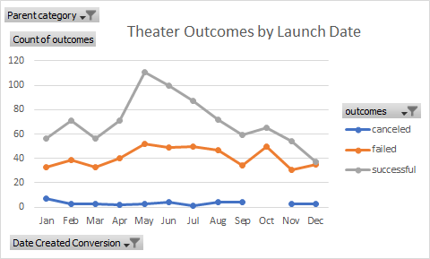
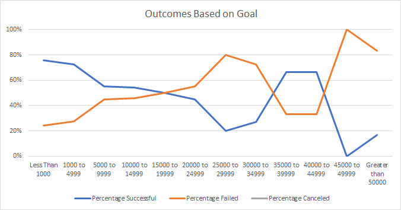

# kickstarter-analysis-

## Table of contents
* [Project title](#project-title)
* [General info](#general-info)
* [Technologies](#technologies)
* [Analysis and Challenges](#analysis-and-challenges)

## Project title
Kickstarter Analysis - Module 1 Challenge

## General info
The purpose of this project is to analyze how different campaigns fared in relation to their launch dates and their funding goals. In order to analyze this collection of data, we were asked to visualize campaign outcomes based on their launch dates and their funding goals. 

## Technologies
Microsoft Excel for Microsoft 365 MSO

## Analysis and challenges
### Overview ###
 On this sheet which is created with eight columns and twelve rows—students were asked to use different formulas and chart/table functions to analyze the relationships and correlations between data sets, and also to identify patterns and trends for interpretation. e.g., by using the ‘PivotTable’ function, students were able to create a chart (labeled “category Statistics”):
 

From this chart, one can analyze the relationships and correlations between the number of “successful”, “live”, “failed”, “canceled” outcomes and the “Category.” It is fair to conclude that among the “Category,” “Theatre” has the largest number of the “successful” outcomes in this given data. 

### Challenges & Difficulties ###
 The only “challenge” that I encountered was that the instructions in modules show only one formula that they have picked to solve problems. This particular fomula, of course, would give us the correct numbers in cells or charts, but I do believe that there are more than one way to solve each problem, especially when you are using Excel -- there are plenty of advanced formulas and references that students could possibly utilize, rather than following one very stricted way to reach a destination.  I have used different formulas and was able to get the same results throughout this module, but I had to go back and change my formulas since they have used different formulas on modules (as if that were the only way to calculate and analysis that given data sets. However, overall, it was a good practice to see how others would create and insert different formulas and functions in Excel to solve those problems. 

### Theater Outcomes by Launch Date ###
 
 
 Through out the year, the number of “canceled” outcomes does not reach over 10, whereas the numbers of “successful” and “failed” outcomes do not fall below 30; it shows that the chance of getting it cancelled is exceptionally low. The trend that one could identify is that if the number of “successful” outcomes increases, then the number of “failed” outcomes increases simultaneously. i.e., there are four times which the number of “successful” outcomes increases during this year (January - February, March -April, April-May, September – October) and during those four periods, the number of “failed” outcomes increases accordingly. 
 
 One can also conclude that when there is a dramatic change in the number of “successful” outcomes, it does not necessarily cause any major changes to the number of “failed” outcomes. From mid-May to September, the number of “successful” outcomes decreases drastically; it deceases from 110 to 60, which is about 45% and it had an insignificant impact on the number of the “failed” outcomes. One would likely to think that decrease in the number of “successful” outcomes would have a significant impact on the number of “failed” outcomes and would think the number of “failed” would increase. However, the data rejects that hypothesis.  

### Outcomes based on Goals ###

 From this chart, one can conclude that when the goal is high (>=44000), the campaigns have a higher chance of failing and an extremely low chance of succeeding. When the goal is low (<=15000), the campaigns have a higher chance of succeeding and the likelihood of their projects failing is low. 

